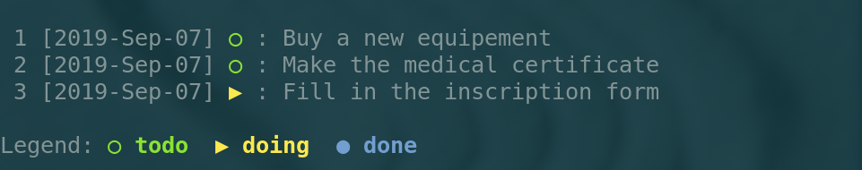
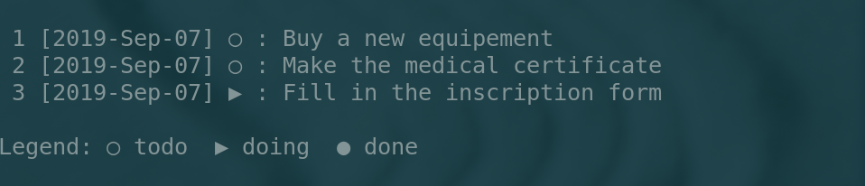
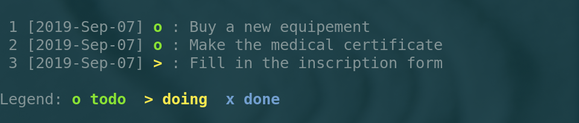
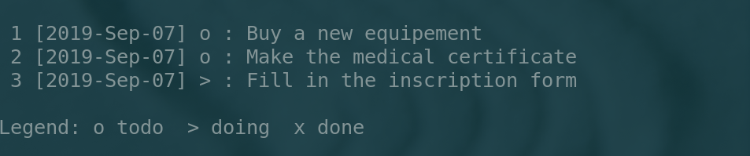

:Title: TODOGO - Quick start guide
:Author: Guillaume Boulant (gboulant@gmail.com)
:Date: Sept. 2019
:Description: Quick start guide for TODOGO
:Email: gboulant@gmail.com

-------------

.. raw:: html

   

   <h1 style="margin-left: 0; margin-right: 0">01 - Userguide</h1>
   

   

   

========
Overview
========

The todo program is a command line application created to manage a
personal todo list from a shell terminal:

.. code:: shell

   $ todo -h
   usage: todo <command> [<options>] [<arguments>]

   With <command> in:

   * new       : Create a new task
   * list      : Print the list of tasks
   * status    : Change the status of tasks
   * board     : Append/Remove tasks on/from the board
   * note      : Edit/View the note associated to a task
   * child     : Make tasks be children of a parent task
   * delete    : Delete tasks (definitely or in archive)
   * archive   : Archive/Restore tasks
   * config    : Manage de configuration

   For a description of possible options, try: todo <command> --help
   
========================
Creating tasks - ``new``
========================

For creating a new task:

.. code:: shell

   $ todo new -t "Write the documentation of todogo"
    1 [2019-Sep-07] ○ : Write the documentation of todogo

The todo task is created with usage index 1. You may complete your
todo list:

.. code:: shell

   $ todo new -t "Write the unit tests of todogo"
    2 [2019-Sep-07] ○ : Write the unit tests of todogo

   $ todo new -t "Create a beautiful web site for todogo"
    3 [2019-Sep-07] ○ : Create a beautiful web site for todogo

Each task is assigned a usage index (1,2,3) to refer to them with the
command line (no mouse to click)

============================
Listing the tasks - ``list``
============================

Then you can have a look on the whole todo list:

.. code:: shell

   $ todo list
   
    1 [2019-Sep-07] ○ : Write the documentation of todogo
    2 [2019-Sep-07] ○ : Write the unit tests of todogo
    3 [2019-Sep-07] ○ : Create a beautiful web site for todogo

   Legend: ○ todo  ▶ doing  ● done
   

The listing display for each task:

* The usage index (1,2,3, ...)
* The date of creation
* The status [todo, doing, done] (see the legend)
* The description text

=========================
Task on board - ``board``
=========================

*"This week you plan to work on the documentation (task 1) and the web
site (task 3)"*, then you can star these tasks by putting them on the
board:

.. code:: shell
   
   $ todo board -a 1,3
   Task of index 1 has been added on board
   Task of index 3 has been added on board

And list the tasks on board to focus on the actuality:

.. code:: shell

   $ todo board
   
    1 [2019-Sep-07] ○ : Write the documentation of todogo
    3 [2019-Sep-07] ○ : Create a beautiful web site for todogo
    
   Legend: ○ todo  ▶ doing  ● done
   
============================
Task life cycle - ``status``
============================

*"You start by writing some documentation and want to point that the
task is in progress"*, then you specify that you jump to the next
status of this task 1 (the status *doing*):

.. code:: shell

   $ todo status -n 1
    1 [2019-Sep-07] ▶ : Write the documentation of todogo

Then the board indicates:

.. code:: shell

   $ todo board

    1 [2019-Sep-07] ▶ : Write the documentation of todogo
    3 [2019-Sep-07] ○ : Create a beautiful web site for todogo
    
   Legend: ○ todo  ▶ doing  ● done
   
Note that todogo defines three possible status:

``○ todo``: the task is registered and is waiting to be done

``▶ doing``: the task is started and is in progress

``● done``: the task is achieved

============================
Task life cycle - ``status``
============================

You achieved the task 1:

.. code::

   $ todo status -n 1
    1 [2019-Sep-07] ● : Write the documentation of todogo

You can now get rid of this task from the board:

.. code:: shell

   $ todo board -r 1
   Task of index 1 has been removed from board

The task is always in the todo list (with status done), but no longer
on the board:

.. code:: shell

   $ todo list
   
    1 [2019-Sep-07] ● : Write the documentation of todogo
    2 [2019-Sep-07] ○ : Write the unit tests of todogo
    3 [2019-Sep-07] ○ : Create a beautiful web site for todogo
    
   Legend: ○ todo  ▶ doing  ● done

   $ todo board

    3 [2019-Sep-07] ○ : Create a beautiful web site for todogo
    
   Legend: ○ todo  ▶ doing  ● done
   
=============================
Archiving tasks - ``archive``
=============================

If you register and then finish a lot of tasks, they could accumulate
in your todo list, with increasing indeces. A good practice is then to
archive the done tasks:

.. code:: shell

   $ todo archive -a 1
   Task 1 moved to the archive with a new usage index: 201909074112222239

Then the todo list is now:

.. code:: shell

   $ todo list
  
    2 [2019-Sep-07] ○ : Write the unit tests of todogo
    3 [2019-Sep-07] ○ : Create a beautiful web site for todogo

   Legend: ○ todo  ▶ doing  ● done

And the archive contains:

.. code:: shell

   $ todo archive

   201909074112222239 [2019-Sep-07] ● : Write the documentation of todogo
   
   Legend: ○ todo  ▶ doing  ● done

Note that when a task is moved to the archive, then its usage index is
modified and set to its global index (see next page).

================
Task identifiers
================

Usage index versus global index
===============================

When created, a task is characterized by:

* a **usage index** (UID), the index seen by the user to manipulate the tasks
* a **global index** (GID), the index used by the program to manage the tasks

.. code:: shell

   $ todo status -i 2

   Task               : Write the unit tests of todogo
   Usage Index  (UID) : 2
   Global Index (GID) : 201909070743126602
   Creation Date      : Saturday 2019-September-07 at 16:04:08
   Status             : todo
   Is on board        : false
   Note filepath      : 
   Parent UID         : 0

Index life cycle:
  
* The global index (GID) is unique and invariant ever
* The usage index (UID) is unique and invariant as long as the
  task is in the journal
* Once a task is move from the journal to the archive, its usage index
  is released and can be reused for a new task.

================
Task identifiers
================

Usage index recycling
=====================

We create a new task:

.. code::

   $ todo new -t "Make it possible to have children tasks associated to a task"
    1 [2019-Sep-07] ○ : Make it possible to have children tasks associated to a task

Note that the usage index 1, previously attributed to the
documentation task (moved to the archive) has been recycled and
attributed to this newly created task:

.. code::

   $ todo list

    2 [2019-Sep-07] ○ : Write the unit tests of todogo
    3 [2019-Sep-07] ○ : Create a beautiful web site for todogo
    1 [2019-Sep-07] ○ : Make it possible to have children tasks associated to a task

   Legend: ○ todo  ▶ doing  ● done

.. note:: **Note**: The reason of this index recycling is to avoid
   increasing indeces, at least in the journal listing, so that you
   can refer to reasonably short indeces when typing your command
   line. Even if there is no maximum limit for indeces, the normal
   usage (i.e. if you achieve your tasks and archive them when
   finished) is to play whith indeces between 1 (the starting index
   value) to 20 or 30.

================
Restoring a task
================

*"We forgot a part of the documentation, but the task is declared as
done and archived"*. Indeed:

.. code:: shell

   $ todo archive

   201909074112222239 [2019-Sep-07] ● : Write the documentation of todogo

   Legend: ○ todo  ▶ doing  ● done

The task can be restored to the journal:

.. code:: shell

   $ todo archive -r 201909074112222239
   Task 201909074112222239 restored from archive with a new usage index: 4

The task has been restored from the archive (where its index was
201909074112222239, i.e. the global index) to the journal with a new
usage index 4 (of course the original index 1 has been reassigned to
another task and the first free usage index in the journal is 4):

.. code:: shell

   $ todo list

    1 [2019-Sep-07] ○ : Make it possible to have children tasks associated to a task
    2 [2019-Sep-07] ○ : Write the unit tests of todogo
    3 [2019-Sep-07] ○ : Create a beautiful web site for todogo
    4 [2019-Sep-07] ● : Write the documentation of todogo
    
   Legend: ○ todo  ▶ doing  ● done

The restored task is on status done, and it could be relevant to move
its status to the previous one in the life cycle (the status "doing"):

.. code:: shell

   $ todo status -p 4
    4 [2019-Sep-07] ▶ : Write the documentation of todogo

================================
Organizing the tasks - ``board``
================================

As with all todo list, the tasks accumulate in the journal as they
came out of your brain:

.. code:: shell

   $ todo list

    1 [2019-Sep-07] ▶ : Make it possible to have children tasks associated to a task
    2 [2019-Sep-07] ▶ : Write the unit tests of todogo
    3 [2019-Sep-07] ○ : Create a beautiful web site for todogo
    4 [2019-Sep-07] ● : Write the documentation of todogo
    5 [2019-Sep-07] ○ : Push a clone of the repository on github
    6 [2019-Sep-07] ● : Create a dockerfile of the todogo application
    7 [2019-Sep-07] ▶ : Write the conceptual design of the dingo application
    8 [2019-Sep-07] ▶ : Setup the technical environment for the dingo application
    9 [2019-Sep-07] ○ : Phone IT center to get a new PC
   10 [2019-Sep-07] ○ : Book an hotel for the workshop in Melun
   11 [2019-Sep-07] ○ : Write a prototype of dingo to validate the design
   12 [2019-Sep-07] ○ : Write a project proposition to get a budget for dingo
   
   Legend: ○ todo  ▶ doing  ● done

The board is a good practice to focus on some tasks:

.. code::

   $ todo board

    2 [2019-Sep-07] ▶ : Write the unit tests of todogo
    3 [2019-Sep-07] ○ : Create a beautiful web site for todogo
   10 [2019-Sep-07] ○ : Book an hotel for the workshop in Melun

   Legend: ○ todo  ▶ doing  ● done

================================
Organizing the tasks - ``child``
================================

Grouping tasks with a parent task
=================================

All the tasks are in the same bag, but:

* The tasks 1,2,3,4,5,6 concern the todogo project,
* While 7,8,11,12 concern another project dingo,
* And 9,10 are administrative tasks.

A point of view is to consider these tasks as sub-tasks of
macro-tasks refering to todogo, dingo and admin.

Todogo defines the concept of **child** task to manage this
situation. You create three new tasks:

.. code:: shell

   $ todo new -t "TODOGO: project todogo"
   13 [2019-Sep-07] ○ : TODOGO: project todogo

   $ todo new -t "DINGO: project dingo"
   14 [2019-Sep-07] ○ : DINGO: project dingo

   $ todo new -t "ADMIN: administrative tasks"
   15 [2019-Sep-07] ○ : ADMIN: administrative tasks

Then, you can declare the previous tasks as child tasks of these newly
created tasks:

.. code:: shell

   $ todo child -p 13 -c 1,2,3,4,5,6
   $ todo child -p 14 -c 7,11,12
   $ todo child -p 15 -c 9,10

================================
Organizing the tasks - ``child``
================================

Listing the tree representation
===============================

The child-parent relashionship can be used to print a tree
representation of the tasks with the option ``-t`` of the command
``list``:

.. code:: shell

   $ todo list -t

   13 [2019-Sep-07] ○ : TODOGO: project todogo
    └─ 1 [2019-Sep-07] ▶ : Make it possible to have children tasks associated to a task
    └─ 2 [2019-Sep-07] ▶ : Write the unit tests of todogo
    └─ 3 [2019-Sep-07] ○ : Create a beautiful web site for todogo
    └─ 4 [2019-Sep-07] ● : Write the documentation of todogo
    └─ 5 [2019-Sep-07] ○ : Push a clone of the repository on github
    └─ 6 [2019-Sep-07] ● : Create a dockerfile of the todogo application
    
   14 [2019-Sep-07] ○ : DINGO: project dingo
    └─ 7 [2019-Sep-07] ▶ : Write the conceptual design of the dingo application
    └─ 8 [2019-Sep-07] ▶ : Setup the technical environment for the dingo application
    └─11 [2019-Sep-07] ○ : Write a prototype of dingo to validate the design
    └─12 [2019-Sep-07] ○ : Write a project proposition to get a budget for dingo
    
   15 [2019-Sep-07] ○ : ADMIN: administrative tasks
    └─ 9 [2019-Sep-07] ○ : Phone IT center to get a new PC
    └─10 [2019-Sep-07] ○ : Book an hotel for the workshop in Melun

   Legend: ○ todo  ▶ doing  ● done

Note that there is no limit in the depth of the tree relashionship but
it is a good practice to have 2 or 3 levels maximum (one level only in
this example).
   
==================================
Organizing the tasks - ``context``
==================================

Different workspaces for different contexts
===========================================

*"I would need to manage a todo list for my sport association, but I
don't want to mix them up with my job todo list"*.

todogo defines the concept of **context** to manage this situation. A
context is a named workspace where the journal of tasks is
stored. When you start using todo, a defaut context is created
automatically, but you can create manually as many contexts as you
need, and then switch between these contexts.

The contexts are managed using the command ``config``:

.. code:: shell

   $ todo config

     default : /home/guillaume/.config/galuma/todogo/default
   ● demo    : /home/guillaume/.config/galuma/todogo/demo

   Legend: ● active context

The listing indicates that:

* Two contexts (default and demo) are defined in my configuration
* The paths specify the workspace directories of the contexts   
* The context demo is the current active context

==================================
Organizing the tasks - ``context``
==================================

Creating a context
==================

Creating a new context with the name ``sport``:

.. code:: shell
   
   $ todo config -n sport
   WRN: You did't specify the context path. Default to sport
   Creating the context sport with path sport

     default : /home/guillaume/.config/galuma/todogo/default
     demo    : /home/guillaume/.config/galuma/todogo/demo
   ● sport   : /home/guillaume/.config/galuma/todogo/sport

   Legend: ● active context

The context sport is automatically set as the active context. The todo
list of this new created context is empty and ready to register your
sport todo list:

.. code:: shell

   $ todo list

   No tasks. Go have a drink

   $ todo new -t "Buy a new equipement"
    1 [2019-Sep-07] ○ : Buy a new equipement
   $ todo new -t "Make the medical certificate"
    2 [2019-Sep-07] ○ : Make the medical certificate
   $ todo new -t "Fill in the inscription form"
    3 [2019-Sep-07] ○ : Fill in the inscription form

   $ todo list

    1 [2019-Sep-07] ○ : Buy a new equipement
    2 [2019-Sep-07] ○ : Make the medical certificate
    3 [2019-Sep-07] ○ : Fill in the inscription form

   Legend: ○ todo  ▶ doing  ● done

==================================
Organizing the tasks - ``context``
==================================

Selecting an active context
===========================

*"Hey! But where is my job todo list?"* The job todo list was created
with the demo context, and you currently point to the sport context:

.. code:: shell

   $ todo config

     default : /home/guillaume/.config/galuma/todogo/default
     demo    : /home/guillaume/.config/galuma/todogo/demo
   ● sport   : /home/guillaume/.config/galuma/todogo/sport

   Legend: ● active context

Then you just have to switch back to the demo context:

.. code:: shell

   $ todo config -s demo

     default : /home/guillaume/.config/galuma/todogo/default
   ● demo    : /home/guillaume/.config/galuma/todogo/demo
     sport   : /home/guillaume/.config/galuma/todogo/sport

   Legend: ● active context

And retrieve your job todo list:

.. code:: shell

   $ todo board

    2 [2019-Sep-07] ▶ : Write the unit tests of todogo
    3 [2019-Sep-07] ○ : Create a beautiful web site for todogo
   10 [2019-Sep-07] ○ : Book an hotel for the workshop in Melun

   Legend: ○ todo  ▶ doing  ● done

==========================
Annoting a task - ``note``
==========================

Sometimes, you need to complete a task description with some
additional pieces of information.

todogo defines the concept of **note** to manage this
situation. Technically speaking, a note is a plain text file
associated to a task and that you can edit to put information in
it. These files are stored in the workspace associated to the
context.

Let's go back to the sport context:

.. code:: shell

   $ todo list

    1 [2019-Sep-07] ○ : Buy a new equipement
    2 [2019-Sep-07] ○ : Make the medical certificate
    3 [2019-Sep-07] ○ : Fill in the inscription form

   Legend: ○ todo  ▶ doing  ● done

And add some details concerning the inscription form (task 3):

.. code:: shell

   $ todo note -e 3
   The note of the task 3 can be edited in file:
   /home/guillaume/.config/galuma/todogo/sport/notes/201909073921949778.rst

A text file is created in the sport context workspace with a base name
created from the task global id (GID). Todogo does not provide the
function to edit this file, and you may choose your prefered editor to
write the content:

.. code:: shell

   $ vi /home/guillaume/.config/galuma/todogo/sport/notes/201909073921949778.rst

.. note:: **Note**: this limitation is applied on purpose, due to the
   requirement to not use any external sofware program from
   todogo. The main reason is that the external software programs
   could be not installed on you host. Personnaly I would prefer to
   choose my prefered editor (``vi`` of course), and creating a
   parameter in the todogo configuration for that is too much job for
   very low benefit.

==========================
Annoting a task - ``note``
==========================
   
Once you have written some text into the note file, you can print the
content:

.. code:: shell
   
   $ todo note -v 3
   03 - Fill in the inscription form
   =================================
   
   The fee for the inscription form is 230€ (to be payed using the RIB XXX).
   The contact to get detailled information is Mme C. Coule.
   The date of the first training session is 15 of september.

If you don't remember the filepath of this note file, just type the
edit command (``note -e``):

.. code:: shell

   $ todo note -e 3
   The note of the task 3 can be edited in file:
   /home/guillaume/.config/galuma/todogo/sport/notes/201909073921949778.rst
 
Alternativelly, you may print the metadata of the task using the
``status -i`` command:

.. code:: shell

   $ todo status -i 3

   Task               : Fill in the inscription form
   Usage Index  (UID) : 3
   Global Index (GID) : 201909073921949778
   Creation Date      : Saturday 2019-September-07 at 19:11:13
   Status             : todo
   Is on board        : false
   Note filepath      : /home/guillaume/.config/galuma/todogo/sport/notes/201909073921949778.rst
   Parent UID         : 0

===============================
Configuring Todogo - ``config``
===============================

A complete information concerning the configuration of the Todogo
program can be printed using:

.. code:: shell
   
   $ todo config -i
   
   Configuration files:
   -------------------
   
   Configuration root directory: /home/guillaume/.config/galuma/todogo
   Configuration file path     : /home/guillaume/.config/galuma/todogo/config.json
   
   Configuration parameters:
   ------------------------
   
   {
       "DefaultCommand": "board",
       "PrettyPrint": true,
       "WithColor": true
   }
   
   List of contexts:
   ----------------
   
     default : /home/guillaume/.config/galuma/todogo/default
     demo    : /home/guillaume/.config/galuma/todogo/demo
   * sport   : /home/guillaume/.config/galuma/todogo/sport
   
   Legend: * active context

* The configuration is stored in a directory whose path is hard coded
  in todogo as: ``$HOME/.config/galume/todogo``.
* This directory is created at first todo execution if not exists.
* The configuration file is ``config.json`` at the root of the
  configuration directory.

===============================
Configuring Todogo - ``config``
===============================
   
To keep in mind
===============

* Apart for the management of the contexts (create, remove, select),
  there is no todo command to edit the configuration. If you need to
  modify the configuration, you should directly edit the configuration
  file ``config.json`` (it is a command line tool, no?)
* The default location path of a context with name ``<mycontext>`` is
  ``<configdir>/<mycontext>``, i.e. a subdirectory of the
  configuration folder. But you may choose any path for a context when
  you create one (see options of the command ``todo config -n``.

Good practice
=============

* It is a good practice to keep the history of your todo lists and the
  whole configuration directory using a git repository.
* Then we strongly advise to choose the default path when creating a
  context so that the whole set of data files is stored into the
  configuration directory.

.. code:: shell
   
   $ cd $HOME/.config/galuma/todogo
   $ git init
   $ git add *
   $ git commit -m "Initial import"
   $ git push # if you have defined a remote repository

The usage of a remote git repository can be usefull:

* It could be considered as a backup of your data
* You may synchronize your todo lists on all your computers
* You may share the todo lists with other users, even if it is not a
  feature of todogo, which is a personal todo list manager.

===============================
Configuring Todogo - ``config``
===============================

Let's have a look into the configuration file ``$HOME/.config/galuma/todogo/config.json``:

.. code:: json

   {
       "ContextName": "sport",
       "ContextList": [
           {
               "DirPath": "default",
               "Name": "default"
           },
           {
               "DirPath": "demo",
               "Name": "demo"
           },
           {
	       "DirPath": "sport",
               "Name": "sport"
           }
       ],
       "Parameters": {
            "DefaultCommand": "board",
            "PrettyPrint": true,
            "WithColor": true
       }
   }

The parameters that you may change:

* ``DefaultCommand``: the default command when you execute ``todo``
  with no arguments
* ``PrettyPrint``: if true, use pretty symbols when listing
  information (tasks, config)
* ``WithColor``: if true, colorized the listing (task status in
  particular).

===============================
Configuring Todogo - ``config``
===============================

Rendering parameters
====================

=========== ================================================
 Rendering   Parameters
----------- ------------------------------------------------
  |I1|       **PrettyPrint** = true, **WithColor** = true
  |I2|       **PrettyPrint** = true, **WithColor** = false
  |I3|       **PrettyPrint** = false, **WithColor** = true
  |I4|       **PrettyPrint** = false, **WithColor** = false
=========== ================================================

=============================
Exporting tasks in a pdf file
=============================

For printing the todo list on paper, it could be convenient to create
a pdf file from the listing. The output of the command ``todo list``
can be saved either in a text plain file:

.. code:: shell

   $ todo list -t -f todo.txt
   The todo list has been printed in the txt file: todo.txt

Or in a pdf file (just by changing the output file extension):   

.. code:: shell

   $ todo list -t -f todo.pdf
   The todo list has been printed in the txt file: todo.txt
   INFO: texttopdf (PID 16805) started.
   INFO: texttopdf (PID 16805) exited with no errors.
   The todo list has been printed in the pdf file: todo.pdf

.. note:: **Note**: this last command is the only exception to the
   requierment to not use external programs. The pdf output is created
   here using the ``cupsfilter`` program, a low level program which is
   installed on most linux systems.
	    

.. raw:: html

   

   
   

-------------

.. raw:: html

   

   <h1 style="margin-left: 0; margin-right: 0">02 - Getting started</h1>
   

   

   

======================================
Download the source and install todogo
======================================

The todogo application (``todo`` program) is written with the langage
go (https://golang.org). You first need to install go and basic
development tools (git, make). You are supposed here to be sudoers or
to be able to make this software programs installed on your hosts:

.. code:: shell

   $ sudo apt-get install git
   $ sudo apt-get install make
   $ sudo apt-get install golang

Then you can clone the source files and build the ``todo`` executable
program:

.. code:: shell

   $ git clone https://github.com/gboulant/todogo.git
   $ cd todogo
   $ make
   $ make test
   $ sudo make install

This last command install the executable program ``todo`` in the
``$PREFIX/bin`` where PREFIX default to ``/usr/local``.

If you need to install todogo in another folder, replace with:

.. code:: shell
   
   $ PREFIX=/path/to/my/installdir make install

If ``/usr/local/bin`` (more generally ``$PREFIX/bin``) is in your
PATH, then you are ready to start with todogo.

===================
Docker installation
===================

.. code:: docker

   FROM ubuntu

   RUN apt-get update && apt-get upgrade -y && \
       apt-get install -y sudo && \
       apt-get install -y vim && \
       apt-get install -y git && \
       apt-get install -y make

   RUN apt-get install -y golang

   RUN git clone https://github.com/gboulant/todogo.git && \
       cd todogo && make install

-------------

.. raw:: html

   

   <h1 style="margin-left: 0; margin-right: 0">03 - Technical design</h1>
   

   Work in progress!
   

   

============
Requirements
============

Functional requirements:

* Fit my personal usage with paper board
* no sophistaced features, that are never generally never used
   
Requirements:

* Command line application to work in a shell terminal
* Database made of local files only (no network connection required)
* Written in pure go, without external dependency (neither go packages
  nor external shell programs)
